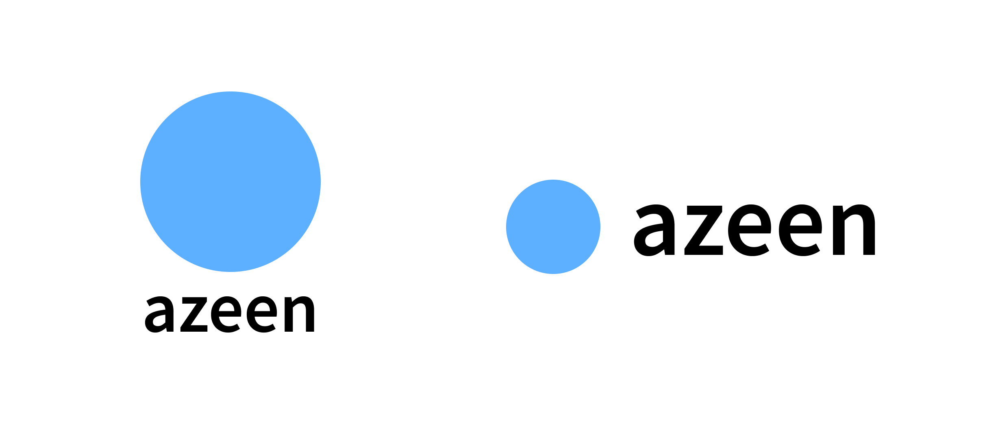

## はじめに
「システムは作れてもデザインができない」
そんな苦手意識を持っている高専生はいないでしょうか。
そんなあなたに1時間でプロのようなロゴを作るコツを教えます。

## 対象者
システム名にオリジナリティを持たせたいのではなく、即席で作りたい方

## 使用ツール
Figma

## 手順
### 1. ロゴを作りやすい名前を考える
以下の条件に満たすようにすると後々に示すテンプレートに当てはまりやすく、作りやすいロゴになります。
- アルファベット
アルファベットのフォントは多いですが、日本語のフォントは少なく、商用利用できないものが多いです。
- 8文字以内
「Zoom」「Slack」「Uber」「PayPay」などの文字数だと縦に並べた際に収まりやすく見やすくなります。

### 2. ロゴづくり
ロゴのスタイルは二種類に分かれます。
- 文字
最も簡単なのはシステム名の頭文字をデザインすること。
- モチーフ
少し凝る必要はあるが、システムのモチーフになるモノをロゴにする。

### 3. フォントを決める
商用利用可能なGoogleフォントを使用しましょう。今回はNoto Sans JP Boldを使用します。
- Noto Sans JP SemiBold
ロゴ、タイトル、本文にも使用できる利便性の高いフォントです。良い意味で特徴が無いので、どんなシステムにも合います。文字の太さは「SemiBold」がベストです。

### 4.合わせる
